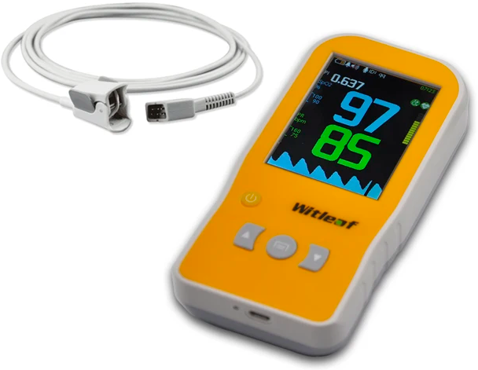
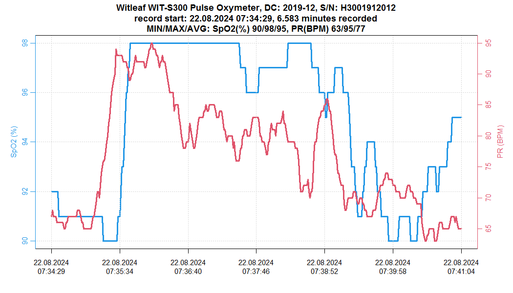

# OxyWitleaf2CSV 

The simple program is a Witleaf handheld pulse oxymeter BIN file format data decoder. It reads BIN-files produced by popular professional pulse oxymeters manufactured by Shenzhen Witleaf Medical Electronics Co., Ltd. (like the WIT-S300 shown in the photo on the right) and produces a CSV-formatted output with the extracted data to stdout (gets printed to the console if not directed otherwise).

## Requirements
 - [Digital Mars D compiler (DMD)](https://dlang.org/download.html) - required to build the BNI->CSV converter itself.
 - [R](https://www.r-project.org/) - is used to create the graphical plots.

All the required R dependancies (`plotrix` and `Cairo`) should get downloaded and installed automatically.

## Preparing for use
1) Install DMD according to your OS or system package manager instructions;
2) Compile OxyWitleaf2CSV from the source file.
   
  - If you use Linux or some other UNIX-like OS:
  
  Open a system shell in the OxyWitleaf2CSV project directory and enter the following command:
  ``` bash   
  ./build.sh
  ```
  - If you use Windows:

  Execute the `build_win.bat` file. 
    
## Usage
 1) Set up your pulse oxymeter. Don't forget to set a correct date and time as it will be used as timestamps for the data samples and some patient name as it will name a file you will use later on.
 2) Record some data at any sample period you want.
 3) Connect the device to your PC using the included MiniUSB <-> USB-A cable (the device will be detected as a general file storage) and copy a BIN-file with the name corresponding to the "patient's name" set up previously to the directory containing OxyWitleaf2CSV project files.
 4) Process the file using OxyWitleaf2CSV.
    
   - If you use Linux or some other UNIX-like OS:

  Open a system shell in the OxyWitleaf2CSV project directory and enter the following command, replacing "patient_name" with your BIN-file name:
   
  ``` bash
  ./oxywitleaf2csv -H -f patient_name.bin > patient_name.csv
  ./csv_graph.R patient.csv
  ```
    
   - If you use Windows: 
  
  Rename the file you just got from the devie to `patient.bin` and execute the `process.bat` file. 
  
  Then open "R Console" and set the current directory to your OxyWitleaf2CSV project directory using the top menu or "setwd()" function. 
  
  Enter the following command into the console:
  ``` R
  input_file = "patient.csv"
  ```
  Open the `csv_graph.R` file and select "Execute all" from the "Edit" menu.
  
 5) Enjoy :).

You will get a CSV file containing 4 columns:
 - "Section" - recording session number;
 - "Timestamp" - full date and time when a sample was taken;
 - "SpO2" - oxygen saturation value;
 - "PR" - pulse rate;

The field separator used is ";".

If you have Microsoft Office 2010 or above, then it is recommended to use LibreOffice as it allows you to choose an appropriate field separator and column format.

You will also get a PNG picture for each recording session named "plot1.png" to "plotN.png" where "N" is the number of recordings available in the BIN file. Each picture will look somewhat like this:

<div></img></div>

If you want smoother graphics with anti-aliasing enabled you can open the "csv_graph.R" file and replace the line ```use_Cairo = FALSE``` with ```use_Cairo = TRUE``` and run the "csv_graph.R" script again to see if the results are more appealing.

The files should be enough to compose your report.
